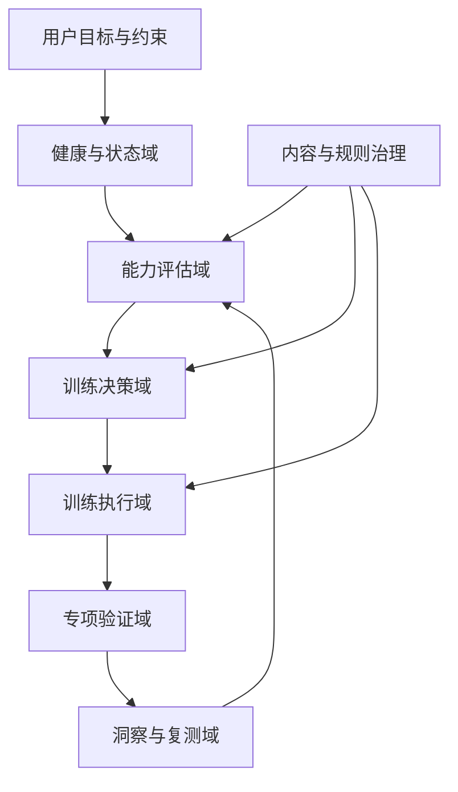
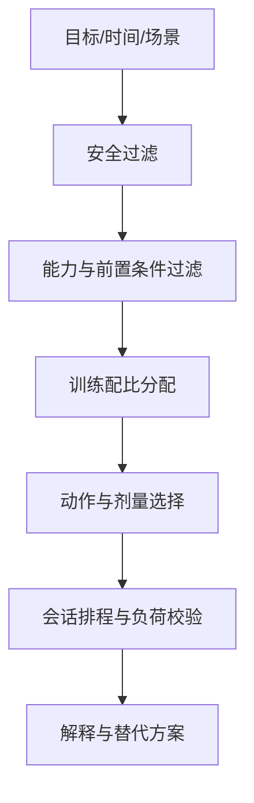
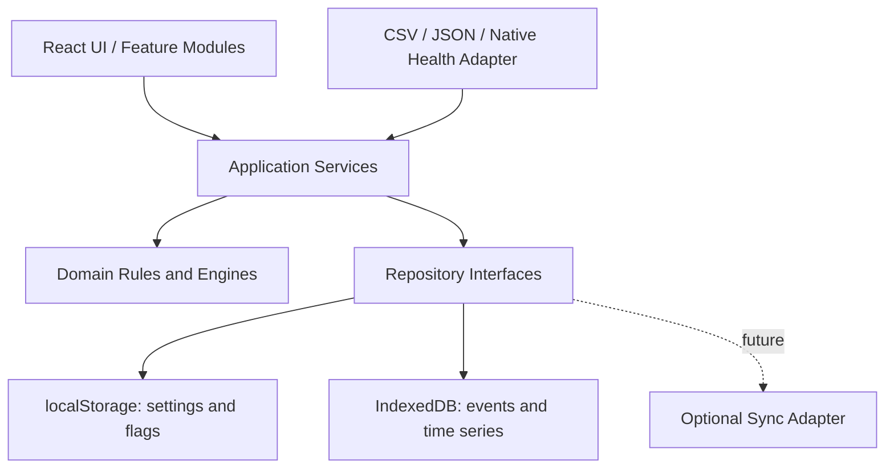

# TT-Companion 总体架构与核心功能迭代方案

> 版本：V2.0  
> 仓库快照：[`codertony/TT-Companion@d0b5738`](https://github.com/codertony/TT-Companion/commit/d0b5738cdbdfd4ee56b931c1c8ba6c56dff34057)  
> 评审日期：2026-09-20  
> 范围：产品能力、领域模型、决策架构、数据架构、技术模块、迭代路线和验收体系。本文只做规划，不修改仓库。

---

## 1. 执行结论

### 1.1 产品应该从什么变成什么

当前 TT-Companion 本质上是：

> **离台训练内容库 + 计时执行器 + ONE CUE 记录器。**

目标不应只是加入更多训练动作或健康指标，而应升级为：

> **以个人状态和能力瓶颈为输入，以安全、可执行、可复测的训练处方为输出的乒乓球个人训练操作系统。**

核心闭环应从当前的：

```text
选场景 → 选时长 → 排列动作 → 完成打卡
```

升级为：

```text
建立基线
  ↓
训练前判断安全与状态
  ↓
识别当前限制因素
  ↓
分配训练重点与负荷
  ↓
执行并采集训练质量
  ↓
周末真实球台验证
  ↓
周期复测与调整
```

### 1.2 当前最重要的架构决策

1. **先做模块化单体，不做微服务**：当前是个人、本地优先应用，复杂分布式架构没有价值。
2. **规则引擎负责安全与处方边界**：不让大模型直接决定训练准入、医疗风险或训练强度。
3. **能力模型与动作库解耦**：能力是用户状态，动作是可被处方的训练资源，不能继续混在一个 `Ability` 枚举中。
4. **记录原始事实，派生结果可重算**：测量值、测试结果、训练事件持久化；readiness、能力等级和 limiter 由带版本的规则计算。
5. **Layer 0 是全局约束层，不是一个孤立页面**：它必须影响首页、计划、动作过滤、强度、复测和数据解释。
6. **先打通一个纵向闭环，再扩充指标**：建议先用“单腿稳定/下肢控制”作为第一个完整验证维度。

### 1.3 暂不做的事情

- 不做疾病诊断和医学风险评分；
- 不把所有能力压成一个总分；
- 不直接上云端多用户系统；
- 不在第一阶段接 HealthKit/Health Connect；
- 不在评估协议尚未稳定前做大模型自动处方；
- 不先建设复杂摄像头动作识别。

---

## 2. 问题重构

| 字段 | 内容 |
|---|---|
| 目标结果 | 用户在只有周末能上球台的情况下，工作日仍能安全、针对性地改善限制乒乓球表现的能力，并能在周末验证迁移效果 |
| 当前证据 | 仓库已实现场景选择、短时训练、动作库、反应刺激、发力链、ONE CUE、周末反馈和打卡数据 |
| 表面问题 | 健康数据、心肺、力量、活动度、平衡等能力没有被收集 |
| 实际问题 | 应用没有统一的“状态—能力—处方—结果”领域模型，数据与专项功能彼此独立，训练生成器只能排序动作 |
| 当前约束 | 移动端优先、无后端、个人使用、碎片时间、工作日离台、周末上台；健康功能必须避免越界诊断 |
| 当前决策 | 重构为模块化训练系统；先建立领域内核和一个纵向闭环，再逐步接入完整 Layer 0 与专项能力评估 |

---

## 3. 当前实现证据与架构断点

| 结论 | 类型 | 置信度 | 证据 | 对架构的影响 |
|---|---|---:|---|---|
| 当前计划生成是过滤和排序，不是处方 | 事实 | 高 | [`src/lib/generator.ts`](https://github.com/codertony/TT-Companion/blob/main/src/lib/generator.ts) | 需要拆出安全、能力、配比和排程四层 |
| `Ability` 同时承担内容分类和用户能力模型 | 事实 | 高 | [`src/types/index.ts`](https://github.com/codertony/TT-Companion/blob/main/src/types/index.ts) | 必须分为 Capacity、TrainingTarget、ExerciseCategory |
| 反应、预判、遮挡、张力结果没有统一持久化 | 事实 | 高 | 页面使用局部 state，现有 Session 不含结果 | 需要统一 PerformanceEvent/AssessmentResult |
| 数据页是打卡统计，不是能力 Dashboard | 事实 | 高 | [`DataPage.tsx`](https://github.com/codertony/TT-Companion/blob/main/src/features/data/DataPage.tsx) | 数据页应改为决策解释与趋势中心 |
| 文档称 PWA，代码没有完整 PWA 实现 | 事实 | 高 | [`vite.config.ts`](https://github.com/codertony/TT-Companion/blob/main/vite.config.ts)、`package.json` | 先修正真实能力，避免后续离线架构建立在假设上 |
| 当前 ONE CUE 闭环值得保留 | 判断 | 高 | Cue → 工作日训练 → 周末反馈已成型 | ONE CUE 应成为处方约束，而非独立功能 |
| Layer 0 会显著改善安全与针对性 | 假设 | 中 | 逻辑成立，但尚无真实使用数据 | 必须用纵向实验验证填写成本和推荐价值 |

### 3.1 当前功能不是没有价值，而是没有连接起来

当前几个功能彼此近似平行：

```text
动作库      反应训练      发力链      预判      ONE CUE      数据页
   │            │           │          │          │           │
   └──────── 页面可用，但缺统一能力模型和结果协议 ───────────────┘
```

真正缺失的是中间的领域内核：

```text
用户当前能承受什么
用户哪项能力限制最大
某个动作为什么被推荐
训练是否改善了该限制
```

---

## 4. 产品能力总架构

建议把产品划分为七个能力域。



| 能力域 | 回答的问题 | 核心产物 |
|---|---|---|
| 用户目标与约束 | 我想改善什么、什么时候能练、有哪些条件 | Goal、Availability、Equipment、ONE CUE |
| 健康与状态域 | 今天能不能练、能练多重 | SafetyDecision、DailyReadiness |
| 能力评估域 | 当前各能力水平和主要短板是什么 | CapacityProfile、LimiterFinding |
| 训练决策域 | 今天训练什么、比例与负荷如何 | TrainingPrescription |
| 训练执行域 | 如何安全而清楚地完成动作 | TrainingPlan、ExecutionEvent |
| 专项验证域 | 离台训练是否迁移到球台和比赛 | ValidationResult、TransferEvidence |
| 洞察与复测域 | 是否进步、什么时候调整 | Trend、Review、RetestSchedule |
| 内容与规则治理 | 动作和判断是否可靠、可追溯 | ProtocolVersion、RuleVersion、EvidenceReview |

---

## 5. 能力模型：从单层枚举升级为二维能力地图

### 5.1 一般身体能力 General Physical Capacity

```text
健康状态
├── 心血管风险与警示症状
├── 身体组成趋势
├── 睡眠与恢复
└── 疼痛与伤病状态

身体基础
├── 有氧与恢复能力
├── 基础力量
├── 活动度
├── 静态与动态平衡
├── 关节控制
└── 基础运动习惯
```

### 5.2 乒乓球表现能力 Table Tennis Performance Capacity

```text
专项身体预备
├── 启动与制动
├── 动态稳定
├── SSC / 弹性能力
├── 灵敏与变向
├── 专项间歇恢复
└── 身体张力调节

感知与控制
├── 视觉搜索
├── 预判
├── 选择反应
├── 节奏判断
├── 本体感觉
└── 动作时序与协调

技术与表现
├── 单项技术
├── 连续稳定性
├── 移动中技术
├── 疲劳后技术保持
├── 战术选择
└── 比赛心理与注意力
```

### 5.3 两个维度如何共同决定训练

不能按“Layer 0 练完才进入专项”的线性方式设计，而应形成矩阵：

| 一般身体能力 | 专项能力 | 训练策略 |
|---|---|---|
| 低 | 低 | 安全建立身体基础，同时做低负荷专项动作学习 |
| 低 | 高 | General 权重上调，保护已有技术质量，限制高冲击专项训练 |
| 高 | 低 | General 维持，主要投入感知、协调、技术和实战迁移 |
| 高 | 高 | 个体化专项突破、比赛策略与细节优化 |

---

## 6. 五个必须闭环的核心业务流程

### 6.1 首次建档与训练准入

```text
基础档案
  → 运动习惯与可用条件
  → 警示症状/已知限制
  → 目标和 ONE CUE
  → 最小基线评估
  → 初始能力画像
  → 第一周保守计划
```

核心功能：

- 身高、体重等基本信息；
- 当前活动水平、每周可训练时间和上台频率；
- 伤病、疼痛、医生限制、可能影响心率的用药提示；
- 主要目标：动作、步法、心肺、稳定、实战等；
- 首次只要求 3–6 项最小测试，避免 onboarding 过重；
- 信息不足时标记“数据不足”，不伪造能力分。

### 6.2 每日训练决策

```text
20 秒 Check-in
  → 安全门
  → 当日负荷调整
  → 当前 limiter 与 ONE CUE 加权
  → 场景/器材/时间过滤
  → 生成今日处方
```

Check-in 首版字段：

- 睡眠时长或睡眠感受；
- 疲劳 1–10；
- 疼痛部位与严重度；
- 是否有疾病或异常症状；
- 可选静息心率；
- 今天所在场景、可用时间和器材。

输出必须可解释：

> “今天疲劳较高且右膝不适，因此移除跳跃和快速随机步法；保留踝髋活动、低速影子和预判训练。”

### 6.3 训练执行

```text
准备说明 → 热身 → 主任务 → 组间恢复 → 质量反馈 → 结束状态
```

每个动作应具备：

- 训练目的；
- 标准动作和 ONE CUE；
- 组/次/时间/休息；
- 最常见错误；
- 停止条件；
- 退阶和进阶动作；
- 左右侧要求；
- 动作完成后的质量反馈，而不仅是“完成”。

### 6.4 周末球台验证

当前四档“明显改善/略有改善/无变化/更差”可以保留，但要扩展成：

| 验证维度 | 示例 |
|---|---|
| 成功率 | 20 球中上台数、目标落点命中数 |
| 稳定性 | 第 1–5 球与第 16–20 球动作质量是否下降 |
| 移动迁移 | 定点有效，两点后是否仍能维持 |
| 疲劳迁移 | 多球后是否出现大臂抢、还原慢等旧问题 |
| 主观感受 | 放松度、发力连贯、信心、注意力负担 |
| 视频证据 | 可选关联一次球台视频，不在首版自动分析 |

### 6.5 周期复测与计划更新

```text
到达复测日
  → 使用同一协议复测
  → 比较趋势与最小有意义变化
  → 判断 limiter 是否仍成立
  → 调整训练配比
  → 生成下一周期目标
```

复测不是简单刷新分数，而要回答：

- 数据是否可比；
- 变化是否来自测量误差；
- 身体能力改善是否迁移到专项表现；
- 当前短板是否已经转移。

---

## 7. 核心功能模块规划

### 7.1 首页 Today

首页从“打卡入口”升级为“今日决策台”：

1. 今日 readiness：绿/黄/红和原因；
2. 当前瓶颈：最多两个；
3. 本周期 ONE CUE；
4. 今日推荐训练：时间、配比、强度；
5. 一键开始；
6. 需要复测或周末验证时显示任务卡。

### 7.2 评估中心 Assess

分为四类：

- 健康与恢复：静息心率、睡眠、疲劳、疼痛；
- 心肺：30 分钟低强度走跑、HRR、RPE、可选 VO₂max；
- 功能力量与控制：深蹲、Split Squat、单腿坐站、俯卧撑、划船、核心；
- 活动度与平衡：踝背屈、髋活动、胸椎旋转、肩活动、单腿站、简化 Y-Balance。

每个评估协议都必须包含：

```text
适用人群 / 前置条件 / 所需器材 / 标准流程 / 单位
有效与无效判定 / 疼痛处理 / 左右侧 / 复测周期 / 协议版本
```

### 7.3 计划中心 Plan

支持三种尺度：

- 今日训练：1–20 分钟；
- 周计划：工作日离台训练 + 周末球台验证；
- 训练周期：4–8 周的重点、负荷和复测安排。

用户仍可手动调整，但系统应展示调整影响：

> “移除单腿稳定后，本周下肢控制训练量将低于处方目标。”

### 7.4 训练执行器 Train

统一承载：

- 普通计时训练；
- 组次型力量训练；
- 左右侧交替；
- 反应刺激；
- 音频提示；
- 心理模拟；
- 视频遮挡；
- 周末专项测试。

避免每种训练建立一套互不相容的页面状态。执行器采用统一 `Block → Set → Step → Event` 模型。

### 7.5 动作与训练内容库 Library

动作条目不再只是文案，应成为可计算的处方资源：

```ts
interface ExerciseDefinition {
  id: string;
  version: string;
  title: string;
  targets: CapacityId[];
  scenes: Scene[];
  equipment: Equipment[];
  doseOptions: DoseTemplate[];
  load: {
    cardio: 'low' | 'medium' | 'high';
    impact: 'none' | 'low' | 'high';
    coordination: 'low' | 'medium' | 'high';
  };
  jointLoadTags: string[];
  prerequisites: RuleRef[];
  contraindicationTags: string[];
  regressionIds: string[];
  progressionIds: string[];
  instructions: Instruction[];
  stopRules: StopRule[];
  evidenceRefs: EvidenceRef[];
  reviewStatus: 'draft' | 'reviewed' | 'deprecated';
}
```

### 7.6 数据与洞察 Insights

Dashboard 分五组：

- Health；
- Cardio；
- Strength；
- Movement；
- Table Tennis。

每张卡统一呈现：当前值、个人基线、趋势、数据来源、新鲜度、可信度、计划影响、复测日期。

### 7.7 设置与数据管理

- JSON/CSV 真正下载与导入；
- schema 迁移；
- 重复数据处理；
- 数据来源标识；
- 清空前备份提示；
- 后续可增加设备数据授权和云同步，但不进入首版核心链路。

---

## 8. 训练安全与 Readiness 架构

### 8.1 三态模型

| 状态 | 产品行为 | 禁止行为 |
|---|---|---|
| Green | 正常处方，再按 limiter 调权 | 不代表医学意义上的“完全健康” |
| Yellow | 自动降负荷、去冲击、缩短组数或建议恢复训练 | 不推荐跳跃、HIIT、随机高速变向等被规则禁用内容 |
| Red | 停止自动处方，提示休息或寻求专业评估 | 不继续生成高低强度替代计划来绕过警示 |

### 8.2 安全决策只使用可解释规则

```ts
interface SafetyDecision {
  state: 'green' | 'yellow' | 'red';
  reasons: DecisionReason[];
  allowedIntensity: 'none' | 'low' | 'medium' | 'high';
  blockedExerciseTags: string[];
  expiresAt: number;
  ruleSetVersion: string;
}
```

规则原则：

- 胸痛、晕厥/接近晕厥、异常气促等由用户主动报告的警示症状进入 Red 路径；
- 睡眠、疲劳、轻中度疼痛、静息心率偏离个人基线进入 Yellow 候选；
- 静息心率首版看 7–14 天个人趋势，不使用一次读数直接诊断；
- 缺数据不能自动等于高风险，应输出“信息不足”和保守建议；
- 所有规则都有版本和测试用例；
- 大模型只能解释已有决策，不能改变安全状态。

### 8.3 Readiness 不建议做成神秘总分

可以提供摘要，但必须保留原因分解：

```text
今日状态：Yellow
原因：睡眠 5.5h；疲劳 7/10；静息心率较 14 日中位数高 8 bpm
影响：训练时长 -30%；去除高冲击和高心肺动作
```

具体数值阈值在首版应作为可配置产品假设，通过个人使用和专业审核校准，而不是作为医学标准发布。

---

## 9. 能力评估与 Limiter 引擎

### 9.1 数据分为四层

```text
Observation       原始测量：24 次、8 cm、142 bpm
AssessmentResult  协议结果：单腿坐站左 8 / 右 12
CapacityState     派生状态：左侧下肢控制偏弱，置信度中
LimiterFinding    决策结论：当前两点步法稳定性的候选限制因素
```

原始数据不可被派生分数覆盖。算法升级后，可以从原始数据重新计算能力状态。

### 9.2 Limiter 不是简单找最低分

```text
Limiter Priority = Deficit
                 × Goal Relevance
                 × Transfer Evidence
                 × Data Confidence
                 × Trainability
```

含义：

- `Deficit`：相对个人历史、左右侧或能力带的缺口；
- `Goal Relevance`：与当前目标是否有关；
- `Transfer Evidence`：球台验证是否支持因果关系；
- `Data Confidence`：数据量、协议一致性和新鲜度；
- `Trainability`：当前周期是否能安全有效改善。

每个 limiter 必须附：

- 判断理由；
- 支持证据；
- 反证或不确定性；
- 推荐训练方向；
- 复测协议与时间；
- 什么结果会使该 limiter 失效。

---

## 10. 训练处方引擎架构

### 10.1 将现有生成器拆为六个阶段



对应纯函数：

```ts
evaluateSafety(input): SafetyDecision
deriveCapacity(assessmentHistory): CapacityProfile
identifyLimiters(capacity, goal, transferEvidence): LimiterFinding[]
allocateTraining(readiness, limiters, schedule): TrainingAllocation
selectExercises(allocation, constraints, catalog): ExerciseSelection[]
composeSession(selection, duration): TrainingPrescription
```

### 10.2 训练配比模型

```ts
interface TrainingAllocation {
  general: number;
  movement: number;
  perception: number;
  technique: number;
  recovery: number;
  rationale: DecisionReason[];
}
```

示例：

| 用户状态 | General | Movement | Perception | Technique | Recovery |
|---|---:|---:|---:|---:|---:|
| 基础明显不足 | 35% | 20% | 10% | 25% | 10% |
| 基础正常、技术瓶颈 | 10% | 15% | 20% | 50% | 5% |
| 疲劳 Yellow | 10% | 10% | 20% | 20% | 40% |

表中数字是产品起始假设，不是固定科学标准；上线前必须用真实计划体验校准。

### 10.3 处方必须包含“为什么”

```ts
interface TrainingPrescription {
  id: string;
  date: string;
  safetyDecisionId: string;
  allocation: TrainingAllocation;
  blocks: TrainingBlock[];
  reasons: DecisionReason[];
  alternatives: PrescriptionAlternative[];
  ruleSetVersion: string;
}
```

任何推荐动作都应回答：

- 为什么是它；
- 它针对哪个 limiter 或 Cue；
- 为什么是这个剂量；
- 为什么没有推荐更高一级动作；
- 用户不方便时可替换为什么。

---

## 11. 训练执行引擎统一模型

当前普通训练、反应训练、预判、心理模拟分别由不同页面管理。建议统一成：

```text
TrainingPrescription
└── Block：热身 / 主训练 / 感知 / 恢复 / 测试
    └── Set：组数、左右侧、重复
        └── Step：动作、刺激、休息、提问
            └── ExecutionEvent：开始、暂停、完成、跳过、疼痛、质量反馈
```

### 11.1 Block 类型

- `timed_exercise`：计时动作；
- `repetition_exercise`：次数/组训练；
- `reaction_stimulus`：视觉或语音刺激；
- `assessment`：标准化测试；
- `video_occlusion`：真实遮挡题；
- `mental_rehearsal`：心理模拟；
- `recovery`：休息、呼吸、放松；
- `on_table_validation`：球台专项验证。

### 11.2 统一执行事件

```ts
interface ExecutionEvent {
  id: string;
  sessionId: string;
  blockId: string;
  type: 'start' | 'pause' | 'resume' | 'complete' | 'skip' | 'pain' | 'quality';
  at: number;
  payload?: Record<string, unknown>;
}
```

这样可以统一解决：

- 中途退出和恢复；
- 真实训练时长；
- 跳过原因；
- 疼痛事件；
- 专项正确率；
- 动作质量自评；
- 后续行为分析。

---

## 12. 数据与存储架构

### 12.1 本地优先的模块化单体



### 12.2 为什么不继续把全部数据放在 Zustand persist

Zustand 适合 UI 和当前会话状态，不应承担完整领域数据库：

- 时间序列会不断增长；
- 需要按日期、指标、来源查询；
- 导入可能产生大量记录；
- 需要事务、去重和迁移；
- 后续可能关联视频元数据或设备记录。

建议：

| 数据 | 存储 |
|---|---|
| 主题、提示设置、当前 UI 状态 | Zustand + localStorage |
| 用户档案、目标、规则选择 | Repository，可先 localStorage |
| Observation、Assessment、Session、Event | IndexedDB |
| 大视频文件 | 首版不内置；只存外部引用或用户选择的元数据 |
| 云同步 | 后期通过 Repository/Sync Adapter 接入 |

### 12.3 数据来源与版本

```ts
type DataSource =
  | 'manual'
  | 'assessment'
  | 'csv_import'
  | 'device_import'
  | 'health_connect'
  | 'healthkit';

interface Observation<T = number> {
  id: string;
  metricId: string;
  value: T;
  unit?: string;
  observedAt: number;
  source: DataSource;
  sourceRecordId?: string;
  protocolVersion?: string;
  importBatchId?: string;
  context?: Record<string, string | number | boolean>;
}
```

必须具备：稳定 ID、单位、时间、来源、协议版本、导入批次和去重键。

### 12.4 导入优先级

1. 手工录入；
2. JSON 完整备份恢复；
3. CSV 通用导入；
4. 运动平台导出文件适配；
5. 原生 Health Connect/HealthKit。

纯 PWA 无法直接把 HealthKit/Health Connect 当作浏览器 API。自动同步需要原生壳或配套原生应用，因此不应阻塞核心闭环。

---

## 13. 前端模块与目录规划

建议从“按页面散落”升级为“领域功能 + 共享内核”：

```text
src/
├── app/
│   ├── routes.tsx
│   ├── providers.tsx
│   └── bootstrap.ts
├── domain/
│   ├── profile/
│   ├── safety/
│   ├── capacity/
│   ├── assessment/
│   ├── prescription/
│   ├── training/
│   └── validation/
├── application/
│   ├── buildDailyPrescription.ts
│   ├── recordAssessment.ts
│   ├── completeTrainingSession.ts
│   └── reviewTrainingCycle.ts
├── features/
│   ├── today/
│   ├── onboarding/
│   ├── readiness/
│   ├── assess/
│   ├── plan/
│   ├── train/
│   ├── validate/
│   ├── insights/
│   └── settings/
├── content/
│   ├── exercises/
│   ├── assessments/
│   ├── rules/
│   └── evidence/
├── infrastructure/
│   ├── repositories/
│   ├── indexeddb/
│   ├── import-export/
│   └── sync/
└── shared/
    ├── ui/
    ├── time/
    ├── ids/
    └── validation/
```

关键约束：

- `domain/` 不依赖 React、浏览器和 Zustand；
- 处方与安全规则全部是可测试纯函数；
- `features/` 只负责编排交互；
- `content/` 是版本化知识资产，不散落在组件中；
- `infrastructure/` 实现持久化和导入，领域层只依赖接口。

---

## 14. 产品导航建议

当前首页/训练/数据/我的可以保留四个底部 Tab，但重新定义：

| Tab | 职责 |
|---|---|
| 今天 | readiness、当前 limiter、ONE CUE、今日处方、一键开始 |
| 训练 | 今日/本周计划、训练内容库、专项训练入口 |
| 进展 | 五类 Dashboard、球台验证、复测和周期复盘 |
| 我的 | 档案、目标、器材、评估中心、数据管理和设置 |

“评估中心”首版可放在“我的”，成熟后如果使用频率上升再成为独立入口。

---

## 15. 内容与专业知识治理

当前动作内容混合了工程实现、经验描述、知乎/B站等外部资料。未来动作数量增加后，必须建立内容治理：

```ts
interface EvidenceRef {
  id: string;
  title: string;
  url?: string;
  sourceType: 'guideline' | 'paper' | 'expert' | 'tutorial';
  supports: string[];
  limitations?: string;
  reviewedAt?: number;
}
```

内容发布状态：

```text
Draft → Technical Review → Sports/Medical Review → Published → Deprecated
```

重点审核：

- “手腕不动”“肘固定”“脚跟不落地”等绝对表述；
- 触球前固定毫秒数；
- 动作适用人群与训练阶段；
- 疼痛、膝踝和心肺风险；
- 左右手持拍差异；
- 初学者与进阶者的退阶/进阶方案。

---

## 16. 质量、测试与可观测性

### 16.1 测试金字塔

| 层级 | 必测内容 |
|---|---|
| 领域单测 | 安全规则、能力派生、limiter 排序、训练配比、动作过滤、剂量校验 |
| 规则黄金用例 | 固定用户档案和输入必须生成固定可解释结果 |
| 属性测试 | Red 不得生成训练；禁用标签不得进入处方；总时长不能超预算 |
| 数据测试 | schema migration、导入去重、重复执行幂等、损坏备份回滚 |
| 组件测试 | Check-in、评估流程、训练暂停恢复、疼痛退出 |
| E2E | 首次建档→评估→生成→训练→周末验证→复测完整纵向链路 |
| 浏览器验证 | 移动端、离线、后台切换、屏幕锁定、深色模式、可访问性 |

### 16.2 领域不变量

- Red 状态绝不生成训练处方；
- Yellow 被禁用的冲击动作绝不进入计划；
- 没有协议版本的测试结果不得参与跨周期比较；
- 派生分数不覆盖原始 Observation；
- 同一导入源记录不会重复写入；
- 不完整训练不能被记录为完整完成；
- 训练计划必须解释到输入数据和规则版本；
- 任何规则更新不静默篡改历史决策。

### 16.3 最小产品指标

- Check-in 完成时间；
- 计划启动率和完成率；
- 被跳过动作及原因；
- Yellow/Red 触发率与误拦截反馈；
- 推荐被手动替换比例；
- 复测完成率；
- limiter 改善率；
- 离台改善向球台表现迁移比例；
- ONE CUE 周期完成率。

---

## 17. 方案选择

| 方案 | 描述 | 优点 | 问题 | 结论 |
|---|---|---|---|---|
| A：继续堆页面 | 给现有项目增加健康页、力量页和更多图表 | 最快看到界面 | 数据与规则继续割裂，生成器仍不理解指标 | 不推荐 |
| B：先做完整平台底座 | 先重构数据库、同步、账号和规则中心 | 架构整齐 | 很久拿不到训练价值，容易过度设计 | 不推荐 |
| C：领域内核 + 纵向切片 | 建最小领域模型，用一个 limiter 打通评估到复测 | 最快验证核心价值，架构可持续 | 初期覆盖指标少 | 推荐 |

什么证据会推翻方案 C：

- 真实使用表明用户不愿做任何评估；
- 评估结果不能稳定改变训练选择；
- 纵向闭环明显降低训练启动率；
- ONE CUE + 简单训练已经足够满足目标。

---

## 18. 分阶段迭代规划

### Phase 0：真实性与工程地基

目标：先让现有承诺可信，为数据演进做好准备。

核心任务：

1. 修复 `club` 场景空计划；
2. 补完整 PWA，或把产品文案降级为移动 Web App；
3. 实现真实 JSON 下载、导入、校验、版本迁移；
4. 建立统一 Repository 接口；
5. 将反应、预判、张力等结果纳入统一结果模型；
6. 建立训练执行事件和中途恢复；
7. 增加主流程 E2E 基线。

验收：

- 所有场景均能生成计划或返回明确不可生成原因；
- 导出文件可以在空浏览器中完整恢复；
- 文档中的 PWA 能力有浏览器证据；
- 专项训练结果关页后仍可查看；
- 现有功能无数据丢失。

### Phase 1：第一个完整 Layer 0 纵向切片

建议选择：**单腿稳定/下肢控制 → 步法稳定**。

原因：

- 与乒乓球移动关系直接；
- 测试低成本；
- 可以左右对比；
- 有明确退阶和进阶；
- 容易在周末两点步法中验证迁移。

完整链路：

```text
每日疼痛/疲劳 Check-in
  → 单腿站 + 单腿坐站评估
  → 左右差异和置信度
  → 识别“下肢稳定候选 limiter”
  → 生成单腿稳定/分腿蹲/启动制动计划
  → 周末两点移动验证
  → 4–6 周复测
```

验收：

- 用户能看到为什么判断为 limiter；
- Yellow 状态时高冲击动作会被自动降级；
- 每个动作有退阶、进阶、停止条件；
- 复测使用相同协议；
- 改善后 limiter 可以被撤销或降级。

### Phase 2：Layer 0 基础能力中心

扩展到：

- 心肺：30 分钟低强度走跑、HRR、RPE；
- 下肢：深蹲质量、Split Squat、单腿坐站；
- 上肢：俯卧撑、划船；
- 核心：Dead Bug、Side Plank、Bird Dog；
- 活动度：踝、髋、胸椎、肩；
- 平衡：单腿站、简化 Y-Balance；
- 睡眠、静息心率、体重和腰围趋势。

同时上线：能力画像、limiter 引擎、训练配比和周期复测。

### Phase 3：专项能力评估与真实训练闭环

- 反应跟随率和可测反应时分开；
- 真实授权视频遮挡题库；
- 视觉线索、旋转、落点、长短分维度统计；
- 动态稳定、步法准确率和还原质量；
- 连续球与疲劳后技术保持；
- ONE CUE 与量化球台验证关联；
- 离台指标和球台表现的迁移分析。

### Phase 4：设备与视频能力

- CSV/平台导出适配；
- 原生 Health Connect/HealthKit；
- 可选云端同步；
- 训练视频关联；
- 姿态估计与动作事件提取；
- 大模型基于结构化证据生成解释，但不越过规则引擎。

---

## 19. Coding Agent 可执行任务拆分

### Epic A：领域内核

- 新建 `domain/safety`、`capacity`、`assessment`、`prescription`；
- 拆分现有 `Ability`；
- 定义 Observation、AssessmentResult、CapacityState、LimiterFinding；
- 保持现有 UI 可运行，不一次性重写页面。

### Epic B：数据与迁移

- Repository 接口；
- 本地 schema v2；
- 现有 Session/Cue/Feedback 迁移；
- JSON 下载、导入、冲突与回滚；
- 迁移和幂等测试。

### Epic C：Readiness 与安全门

- Check-in UI；
- 绿黄红规则；
- blocked tags；
- 安全解释；
- 黄金用例和不变量测试。

### Epic D：单腿稳定纵向切片

- 两项评估协议；
- 左右结果；
- limiter 规则；
- 动作 prerequisites、regression、progression；
- 周末两点步法验证；
- 周期复测。

### Epic E：处方引擎

- 将 `generatePlan()` 拆分为安全、配比、选择、排程；
- 计划解释；
- 替代动作；
- 总时长和负荷校验；
- 属性测试。

### Epic F：统一执行器

- Block/Set/Step/Event；
- 暂停与恢复；
- 中途疼痛退出；
- 专项结果持久化；
- 现有 ReactionTrainer 适配统一接口。

---

## 20. 最小可信实验

### 假设

加入最小评估和解释型处方后，训练会更有针对性，同时不会因填写负担降低启动率。

### 代表性纵切面

单腿稳定/下肢控制 → 离台稳定训练 → 周末两点移动验证。

### 基线

当前版本：按场景、时长、主观 feeling 和 ONE CUE 排序动作。

### 成功阈值

- 每日 Check-in 中位时间不超过 20 秒；
- 每条推荐可以追溯到数据与规则；
- 疼痛/疲劳日不会推荐被禁用的动作；
- 至少一次真实改变训练内容且用户认为合理；
- 4–6 周后能使用同一协议复测；
- 用户可以判断改善是否迁移到两点移动；
- 训练启动率不低于当前基线的 85%。

### 停止或调整条件

- 大量误拦截；
- 评估无法稳定复现；
- 数据没有改变处方；
- 用户为了完成填写而减少训练；
- 训练结果与球台验证完全不相关。

---

## 21. 最终行动清单

### 现在做

1. 确认总体能力域和二维能力模型；
2. 选择“单腿稳定/下肢控制”为首个纵向切片；
3. 完成领域类型、Repository 和 schema v2 设计；
4. 修 PWA、导入恢复和 `club` 空计划等真实性问题；
5. 建立规则黄金用例和端到端基线。

### 下一步验证

1. Readiness 是否能在 20 秒内完成；
2. 评估结果是否真的改变处方；
3. 用户是否理解 limiter 判断；
4. 工作日训练是否迁移到周末球台；
5. 规则是否存在误拦截或错误放行。

### 后续决策

1. IndexedDB 是否在 Phase 1 就接入，还是先通过 Repository 保持 localStorage；
2. 是否需要原生壳接健康平台；
3. 视频素材的版权、存储和标注方案；
4. 是否支持多用户、教练和远程评估；
5. 是否把动作识别项目与 TT-Companion 合并。

### 明确不做

1. 不用大模型替代医学判断；
2. 不用一个总分掩盖能力结构；
3. 不在闭环验证前堆满所有健康指标；
4. 不先拆微服务；
5. 不把编译通过和 15 个单测通过当作产品正确。

---

## 22. 最终目标

TT-Companion 最终应稳定回答五个问题：

```text
今天是否适合训练？
当前真正限制我乒乓球表现的能力是什么？
今天为什么练这些，而不是别的？
训练过程中发生了什么，质量如何？
几周后用什么证据判断它真的有效？
```

如果这五个问题能够形成可追溯闭环，它才从“训练内容应用”升级为真正的“个人乒乓球训练伴侣”。
